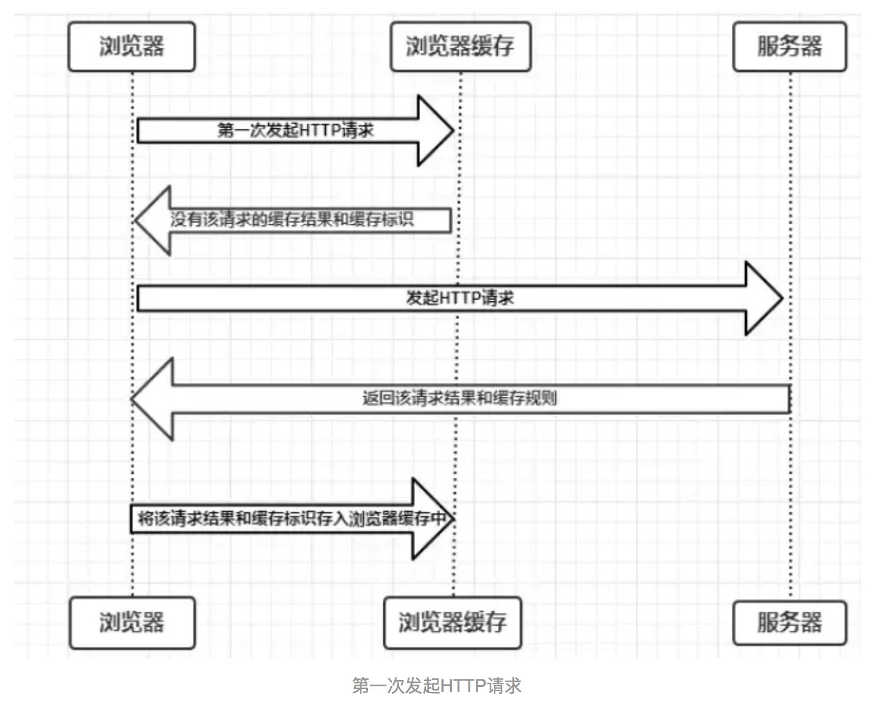
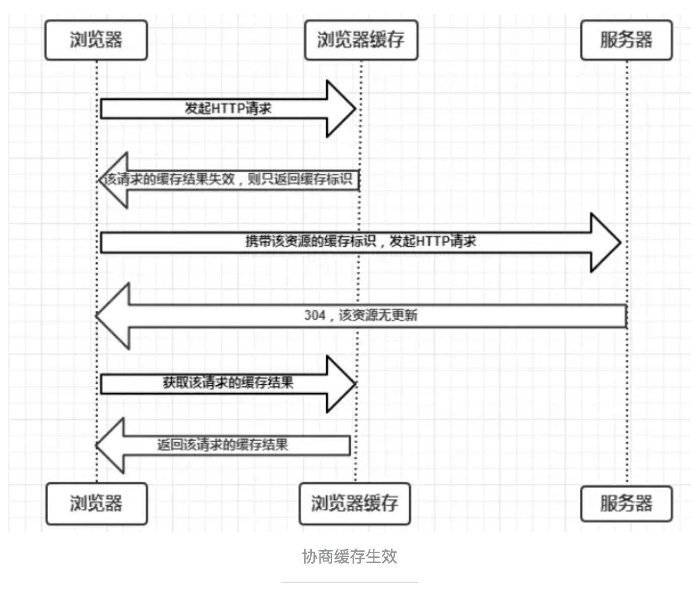
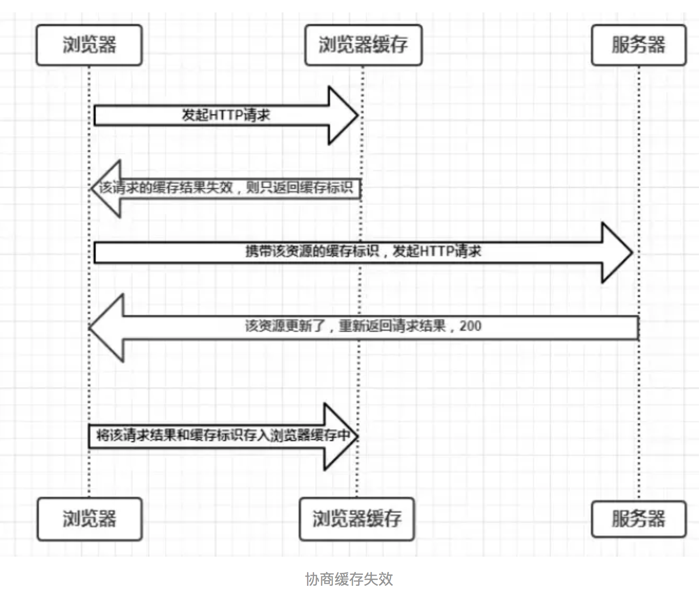
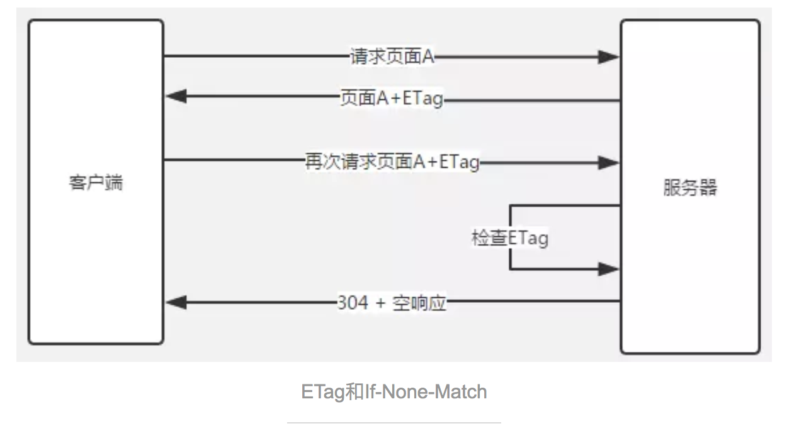
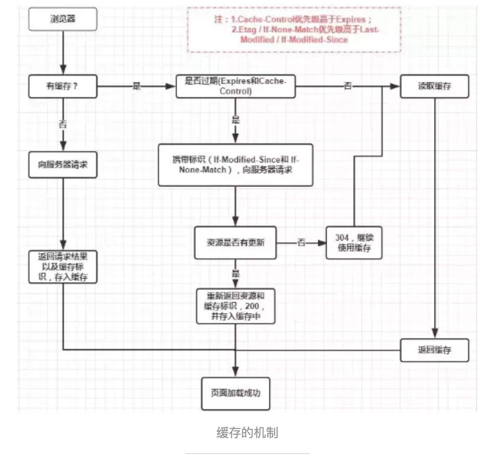

### 浏览器缓存
- 数据请求:
   - 1、网络请求 2、 后端处理 3、浏览器响应
- 作用：浏览器混存 主要是处理 1、3步骤优化性能。
- 缓存位置:
 - Service Worker: 1、注册 Service Worker  2、 监听install事件 3、拦截请求、读取数据
     - 定义: 浏览器背后的独立线程
     - 传输协议必须为 HTTPS
 - Memory Cache(内存中的缓存)
     - 数据读取比磁盘快
     - 持续时间短 随着进程的释放而释放

 - Disk Cache(硬盘中的缓存): Disk Cache 覆盖面基本是最大的, 它会根据HTTP Herder 中的字段判断资源的缓存策略
        - 读取速度慢点
        - 比 Memory Cache 胜在容器和存储时效性上
  - 浏览器会把哪些文件丢进内存/硬盘中？
      - 对于大文件来说，大概率是不存储在内存中的，反之优先
      - 当前系统内存使用率高的话，文件优先存储进硬盘
  - Push Cache(推送缓存)
       - 当以上三种缓存都没有命中时，它才会被使用。它只在会话（Session）中存在，一旦会话结束就被释放，并且缓存时间也很短暂，在Chrome浏览器中只有5分钟左右，同时它也并非严格执行HTTP头中的缓存指令。
- 如果以上四种缓存都没有命中的话，那么只能发起请求来获取资源了。
- 缓存过程分析：
    
- 缓存策略:
  - 强缓存：不会向后端发起请求，直接从浏览器取， 可以通过设置HTTP Header 的 Expires 和 Cache-Control字段实现。
     - Cache-Control优先级高于Expires
     - 强缓存判断是否缓存的依据来自于是否超出某个时间或者某个时间段，而不关心服务器端文件是否已经更新, 故我们要引入协商缓存。
  - 协商缓存: 协商缓存就是强制缓存失效后， 浏览器携带缓存指标向服务器发起请求， 由服务器根据缓存标识决定是否使用缓存的过程。 可以通过设置HTTP Header的 Last-Modified 和 ETag 字段实现。
     - 协商缓存生效，返回304和Not Modified
         
     - 协商缓存失效，返回200和请求结果
         
    - Last-Modified(服务端) 与 if-Modified-Since(客户端)
         - 主要关注在时间的对比上，也受本地时间的影响
         - 如果本地打开缓存文件，即使没有对文件进行修改，但还是会造成 Last-Modified 被修改，服务端不能命中缓存导致发送相同的资源
         - 因为 Last-Modified 只能以秒计时，如果在不可感知的时间内修改完成文件，那么服务端会认为资源还是命中了，不会返回正确的资源

    - ETag(服务端) 与 if-None-Match(客户端)
        - 更加注重于文件内容, 当文件有变化，服务端会生成星的ETag，相比以上方法， 更加准确。
         
    - 注意：
             1、Cache-Control优先级高于Expires；
             2、Etag/ if-None-Match优先级高于Last-Modified / if - Modifiled-Since
- 缓存机制
         <a>
             s
         </a>

