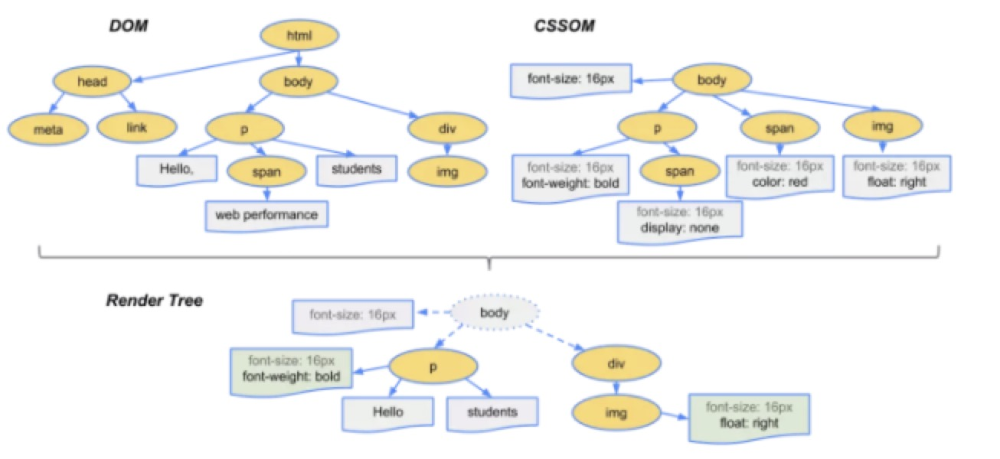

### 浏览器渲染
#### 1、浏览器渲染原理
##### HTML文件 => DOM树
- 字节数据(0 和 1) => 字符串
- 字符串 => Token(标记: 构成代码的最小单位)
- Token => Node => DOM树
##### CSS文件 => CSSOM树

##### DOM树 + CSSOM树 => 渲染树

在这一过程中，不是简单的将两者合并就行了。渲染树只会包括需要显示的节点和这些节点的样式信息，如果某个节点是 display: none 的，那么就不会在渲染树中显示。

当浏览器生成渲染树以后，就会根据渲染树来进行布局（也可以叫做回流），然后调用 GPU 绘制，合成图层，显示在屏幕上。对于这一部分的内容因为过于底层，还涉及到了硬件相关的知识，这里就不再继续展开内容了。

- 重绘： 一些元素需要更新属性，而这些属性只是影响元素的外观，风格，而不会影响布局的，比如background-color...;

- 回流必将引起重绘，而重绘不一定会引起回流。

####  不考虑 缓存、服务端， 加快浏览器渲染速

- 按需加载， 控制script标签， defer（并行下载）、asyn(下载和解析不会阻塞渲染)属性

- 避免频发操作dom从而引起 回流，或者 先display：none； 操作完之后， 再 display： block；

-  尽量用 visitabled 代替 display： none；避免 回流(layout)

- 不要把节点属性值放在一个循环里， 当成循环里的变量

- css选择符从右往左匹配查找， 避免节点层级过多

