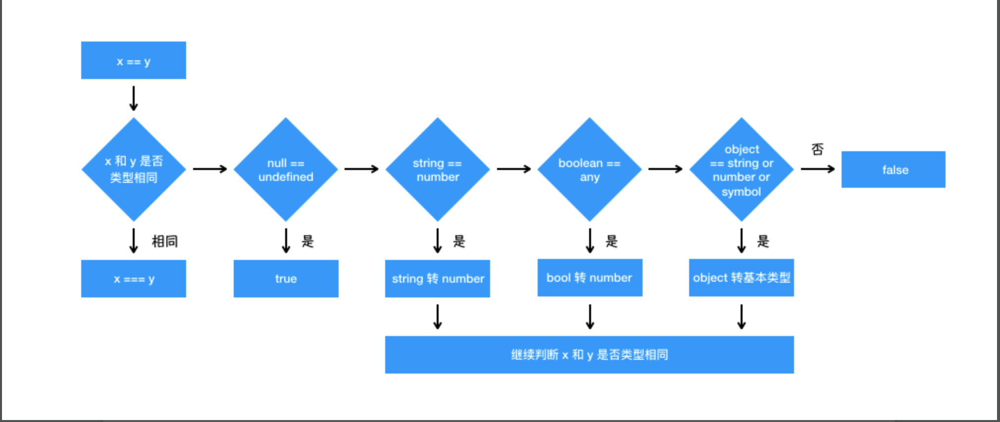

### 你不知道的javascript!
#### 1、typeOf
|typeof | 运行时类型 |
|-------- | -----:|
|  object |         Null |
| object  |       Object |
| function |      Object |
|  number |      Number |
|  string |  String |
|  boolean |     Boolean |
|  undefined |   Undefined |
|  symbol   |    Symbol |
#### 2、 slice、splice、slipt区别
 #### slice(头下表，尾下表) --- 复制
       ⚠️ 1、不改变原数组，返回新数组。
          2、含头不含尾
 #### splice() --- 删除、替换 原数组
       删除： splice(头坐标，删除个数);
       替换： splice(要删除元素的头坐标，删除几个，插入的内容);
       例：移除数组的第三个元素，并在数组第三个位置添加新元素:
       var fruits = ["Banana", "Orange", "Apple", "Mango"];
       fruits.splice(2,1,"Lemon","Kiwi");    // Banana,Orange,Lemo n,Kiwi,Mango
 #### 分解字符串（爆炸)
          let a = 'a-b-c-d';
          a.split('-');  //    ['a','b','c','d']
 ### Event Loop(js)
 #### 基础概念：
 - 堆： 一种数据结构(类似与数组）
 - 栈:  一头开放的数组， 遵从 先进后出 原则
 - 队列:  两头开放的数组， 遵从  先进先出 原则

 循环过程： stack(执行栈) --> 队列(所有异步事件: 微任务、宏任务)

 异步事件执行优先级: 宏任务 > 微任务

 宏任务： script全部代码、setTimeout、setInterval、setImmediate、I/O、UI Rendering

 微任务： Process.nextTick（Node独有）、Promise、MutationObserver

 分析： 初始化页面  script代码压入执行栈， 主线程去执行同步代码， 如遇到 异步事件 会直接将其压如队列，继续执行同步任务。
           执行完同步任务后， 判断执行栈为空， 这时去执行异步任务(判断当前异步任务， 属于宏任务还是微任务)， 因为script代码也   属于宏任务， 所以会直接去执行所有 微任务， 当微任务执行完后 再去执行宏任务，宏任务执行完后 在去执行微任务 如此循环！

 例子：
 ```javascript
 let a = new Promise(
   function(resolve, reject) {
     console.log(1)
     setTimeout(() => console.log(2), 0)
     console.log(3)
     console.log(4)
     resolve(true)
   }
 )
 a.then(v => {
   console.log(8)
 })

 let b = new Promise(
   function() {
     console.log(5)
     setTimeout(() => console.log(6), 0)
   }
 )
 console.log(7)
 ```
 1、执行script同步代码(console.log('1')、console.log('3')、console.log('4')、console.log('5')、console.log('7'))

 2、将异步事件放入队列（ setTimeout(() => console.log(6), 0)、 a.then、setTimeout(() => console.log(2), 0))

 3、待同步任务执行完后， 执行去清空微任务列表 先进先出原则： a.then

 4、当 微任务执行完后 执行宏任务，先进先出原则：console.log('2')、 console.log('6')

 输出：     1、3、4、5、7、8、2、6

 ### == 与 ===
 <a>
     
 </a>

