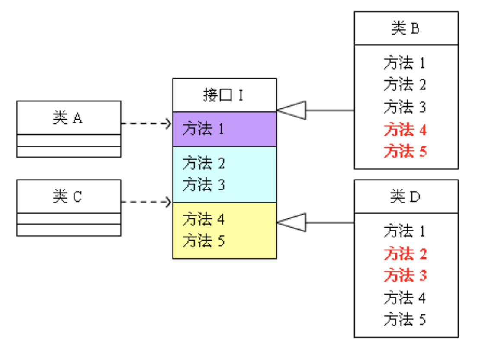
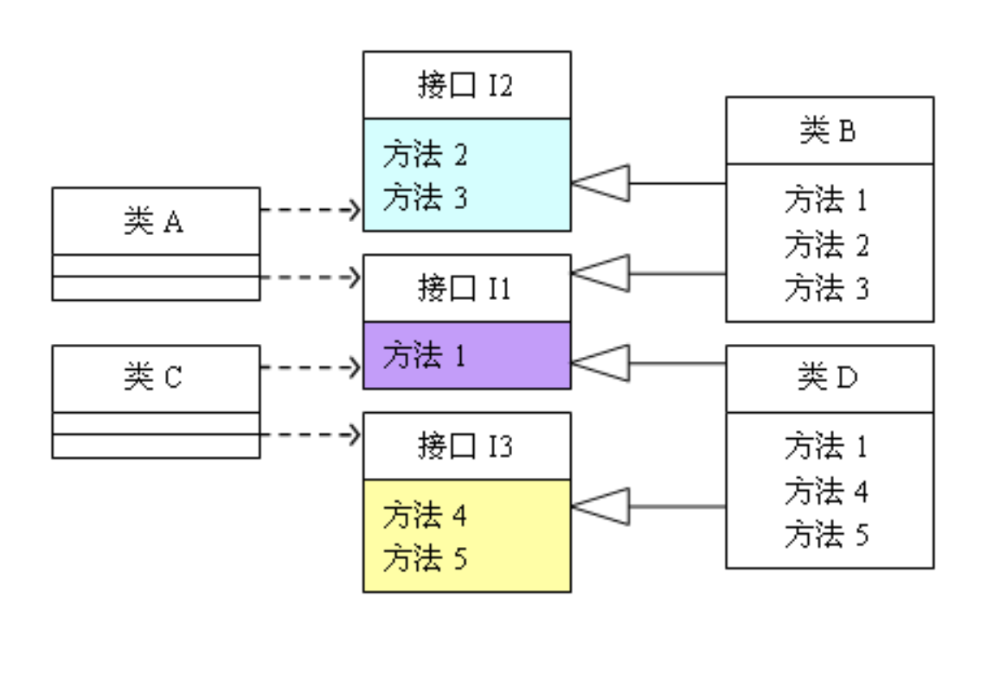

### 面向对象基础原则
- 单一职责：不要存在多于一个导致类变更的原因。
```javascript
       class Man {
            canSay() {
                console.log('说话');
            }
            hasHand() {
                console.log('有手');
            }
            hasFoot() {
                console.log('有脚');
            }
        }
      class Man1 {
            canSay() {
                console.log('说话');
            }
            hasHand() {
                console.log('有手');
            }
            hasFoot() {
                console.log('有脚');
            }
            canSwimming() {
                console.log('会游泳');
            }
      }
     // 以上代码中， 明显 Man类 更符合 单一职责。  因为并不是 每一个正常人都会游泳。
```
- 里氏替换原则: 所有引用基类的地方必须能透明地使用其子类的对象。 说白了 当前原则其实是对继承的进行一些规则上的约束。
    - 理解： 只要父类出现的地方, 都可以用子类来代替，而不会出现任何错误和异常，反之不可。
    - 继承优点：
        - 子类拥有父类所有的方法和属性， 减少创建类的工作量。
        - 提高代码的复用性。
        - 提高代码的扩展性，子类在拥有父类的所有功能的同时，还可以添加自己的功能。
    - 缺点：
        - 继承是侵入性的。 只要继承， 就必须拥有父类的所有属性和方法。
        - 降低了代码灵活性。 继承时， 父类会对子类有一定的约束。
        - 增强了耦合性。 需要修改父类代码时， 必须考虑到对子类产生的影响。
        - 里氏替换原则对继承进行了规则上的约束：
            - 子类可以拥有增加自己特有的方法
            - 当子类覆盖或实现父类的方法时，方法的前置条件(即方法的形参) 要比父类方法的输入参数更加宽松     ？？？？
            - 当子类的方法实现父类(抽象)方法时， 方法的后置条件(即方法的返回值)要比父类更严格  ？？？
            - 子类必须实现父类的抽象方法， 但不得重写(覆盖) 父类的非抽象(已实现)方法。
```javascript
   class P {
        fun(val1, val2) {
            return val1 + val2;
        }
    };
    class C extends P {
        fun(val1, val2) {
            return val1 - val2;
        }
    };
    let Person = new P();
    console.log('父类输出的值', Person.fun(1, 2));
    let Child = new C();
    console.log('子类输出的值', Child.fun(1, 2));
    // 父类输出的值 3
    // 子类输出的值 -1
    // 以上可以看出, 子类重写了父类的非抽象方法， 以至于值错误。
```
- 开闭原则：一个软件实体如类、模块和函数 应该对拓展开发， 对修改关闭。需求变化， 尽量通过扩展软件实体行为来实现变化，而不是通过修改已有的代码来实现变化。例：
```javascript
//    我们有一个产品类
    class Product {
        .......
        一系列方法
        .......
    };
/** 随着业务的发展，我们需要 产品 能拥有打折的方法：
 1、直接在 产品中增加一个 discount方法。
 2、扩展一个子类，显然第二种方法 更符合 开闭原则。
 因为并非所有的产品都有打折的需求。**/
    class DiscountProduct extends Product {
        ......
        discount();
        ........
    };
```
- 依赖倒置原则：
    - 高层模块不因该依赖底层模块， 两者都应该依赖其抽象;
    - 抽象不应该依赖细节;
    - 细节应该依赖抽象;
    - 理解： 可以把抽离出来的一个类 比喻成一个抽象, 类的某一项实例比喻成细节。
- 接口隔离原则：
    - 隔离前：
    <a>
        
    </a>

 - 隔离后：
    <a>
        
    </a>

- 最少知识原则：一个对象应该对其他对象保持最少的了解， 简单的理解就是高内聚，低耦合，一个类尽量减少对其他对象的依赖， 并这个类的方法和属性能私有化就尽量私有化。


