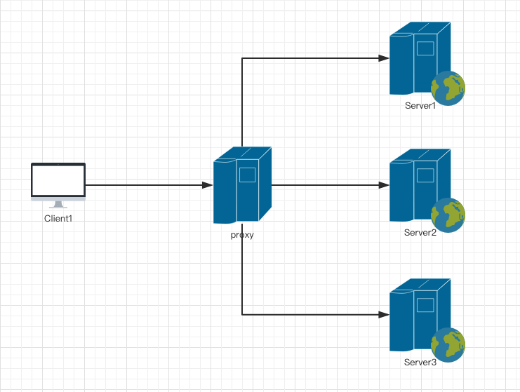

### Nginx
#### 1、 列出所有目录: rpm -ql nginx
#### 2、nginx.conf
            worker_processes： 进程数, cpu数， 有利于处理高并发
            worker_connections: 后台允许最大并发数
            sendfile: 开启高速传输模式
            tcp_nopush: 减少网络报文数量
            keepalive_timeout:   保持链接时间（超时时间）
            gzip: 前端图片压缩格式
            include： 子配置项
#### 3、常用命令
            是否启动： ps aux | grep nginx
            杀死进程： killall nginx
            启动：nginx / systemctl start nginx.service /
            停止：nginx -s stop (直接停止) / nginx -s quit(从容停止, 进程完成工作之后在停止)/systemctl stop nginx.service
            重启：systemctl restart nginx.srevice
            重载:   nginx -s reload
            查看端口号： netstat -tlnp
#### 4、错误页面
          1、多错误指向一个页面：
              配置设置字段： error_page 状态码 页面路径/ 链接(http://xxxxxxxx);
          2、访问设置
            deny： 禁止访问aw
            allow：允许访问
             location 下配置
              {
                deny ip名称；
                allow ip名称；
              }
          例如： 网站img目录 允许所有人访问， admin目录不允许 任何人访问,配置如下
            location =/img{
                 allow all;
          }
            location =/admin {
                 deny all;
          }
          php文件都不允许访问, 正则写法 ～ 连接
            location ~\.php$ {
                  deny all;
            }
            ⚠️  nginx配置权限 按照从上往下执行 有执行顺序区分
#### 5、代理
```
1、正向代理： 为多个客户端代理
2、反向代理： 为服务器端做代理(如下图)
```

```html
配置:
   location / {
       proxy_pass http://xxxxxx;
   }
反向代理还有些常用的指令，我在这里给大家列出:
   proxy_set_header :在将客户端请求发送给后端服务器之前，更改来自客户端的请求头信息。
   proxy_connect_timeout:配置Nginx与后端代理服务器尝试建立连接的超时时间。
   proxy_read_timeout : 配置Nginx向后端服务器组发出read请求后，等待相应的超时时间。
   proxy_send_timeout：配置Nginx向后端服务器组发出write请求后，等待相应的超时时间。
   proxy_redirect :用于修改后端服务器返回的响应头中的Location和Refresh。
```
### 6、nginx 适配PC或移动端设备
```
例如:
    server {
       listen 80;
       server_name xxxx.com;
       location / {
        root /usr/share/nginx/pc;
        if ($http_user_agent ~* '(Android|webOS|iPhone|iPod|BlackBerry)') {
           root /usr/share/nginx/mobile;
        }
        index index.html;
       }
    }
```

