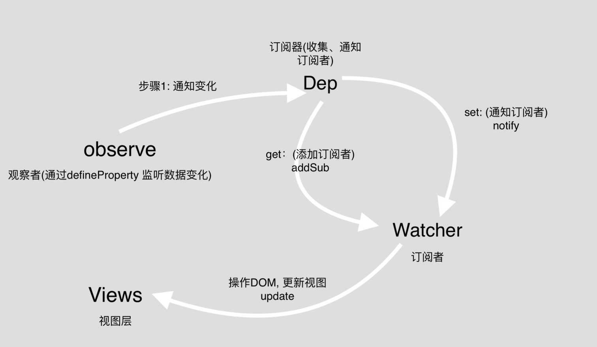

### Vue
 #### 源码分析
  - vue自身选项、component选项合并策略

 - 事件响应基本流程：
 <a>
     
 </a>
我们这里可以认为Vue实例中的data中的每一项属性是一个Dep，而所有用到这个属性的地方都是这个Dep的一个订阅者（watcher），当这个属性值变化时，观察者通过监听捕获变化，告诉这个dep去notify每一个订阅者。

- 基本代码实现:

```html
<!DOCTYPE html>
<html lang="en">
<head>
    <meta charset="UTF-8">
    <title>myVue</title>
</head>
<script src="./my-vue.js"></script>
<body>
    <div id="app">
        <input id="888" v-model="name">
        <div>{{name}}</div>
        <input id="888" v-model="name">
        <div>{{name}}</div>
    </div>
</body>
<script>
    new Vue({
        el: '#app',
        data: {
            name: 'vueName222'
        },
        mounted() {
            console.log('我是mounted钩子');
        }
    });
</script>
</html>
```
```javascript
(function (global, factory) {
    typeof exports === 'object' && typeof module !== 'undefined' ? module.exports = factory() :
        typeof define === 'function' && define.amd ? define(factory) :
            (global = global || self, global.Vue = factory());
}
(this,function () {
    var Watcher = function Watcher (  // 订阅者
        vm,
        expOrFn,
        cb
        ) {
            this.vm = vm;
            this.exp = expOrFn;
            this.cb = cb;
            this.value = this.get(); // 触发依赖收集
        };
Watcher.prototype.get = function get () {
    pushTarget(this);
    var value = this.vm.$options.data[this.exp];
    popTarget();
    return value;
}
Watcher.prototype.run = function run() { // 获取到 值， 调用 自身传进来的 cb，  更新视图
    let value = this.vm.$options.data[this.exp];
    let oldValue = this.value;
    if (value !== oldValue) {
        this.value = value;
        this.cb.call(this.vm, value, oldValue);
    }
}
Watcher.prototype.update = function update() {
    this.run();
}
Watcher.prototype.addDep = function addDep (dep) {
    dep.addSub(this);
};

var Dep = function Dep () { // 订阅器 主体对象
    this.subs = [];
};
Dep.prototype.addSub = function addSub (sub) {
    this.subs.push(sub);
};
Dep.prototype.depend = function depend () {
    if (Dep.target) {
        Dep.target.addDep(this);
    }
};
Dep.prototype.notify = function notify () {
    var subs = this.subs.slice();
    for (var i = 0, l = subs.length; i < l; i++) {
        subs[i].update();
    }
};
Dep.target = null;

function pushTarget (watcher) {
    // targetStack.push(target);
    Dep.target = watcher;
}
function popTarget () {
    Dep.target = null;
    // targetStack.pop();
    // Dep.target = targetStack[targetStack.length - 1];
}


function defineReactive$$1 (
    obj,
    key,
    val,
    customSetter,
    shallow
) {
    var dep = new Dep();
    observe(val);
    Object.defineProperty(obj, key, {
        enumerable: true,
        configurable: true,
        get: function reactiveGetter () {
            if (Dep.target) {
                dep.depend();
                // if (childOb) {
                //   childOb.dep.depend();
                //   if (Array.isArray(value)) {
                //     dependArray(value);
                //   }
                // }
            }
            return val
        },
        set: function reactiveSetter (newVal) {
            if (newVal === val || (newVal !== newVal && val !== val)) {
                return
            }
            val = newVal;
            dep.notify();
        }
    });
 }


var Observer = function Observer (value) {  // 观察者
    this.value = value;
    this.walk(value);
};
Observer.prototype.walk = function walk (obj) {
    var keys = Object.keys(obj);
    for (var i = 0; i < keys.length; i++) {
        let val = obj[keys[i]];
        defineReactive$$1(obj, keys[i], val);
    }
};
function observe (value, asRootData) {
    function isObject (obj) {
        return obj !== null && typeof obj === 'object'
    }
    if (!isObject(value)) {
        return
    }
    var ob;
    ob = new Observer(value);
    return ob
}
function initData(vm) {
    var data = vm.$options.data;
    console.log('zzzData', data);
    data = vm._data = typeof data === 'function'? getData(data, vm): data || {};
    // observe data
    observe(data, true /* asRootData */); // 数据劫持 入口
}
function initState(vm) {
    var opts = vm.$options;
    if (opts.data) {
        initData(vm);
    } else {
        observe(vm._data = {}, true /* asRootData */);
    }
}
function callHook(vm, val) {
    vm.$options[val]();
}
function initMixin(Vue) {
    Vue.prototype._init = function(options) {
        var vm = this;
        this._vm = this;
        vm.$options = options;
        initState(vm);
        if (vm.$options.el) {
            vm.$mount(vm.$options.el);
        }
        callHook(vm, 'mounted'); // mounted钩子
    }
}
function Vue(options) {
    if (!(this instanceof Vue)) {
        warn('Vue is a constructor and should be called with the `new` keyword');
    }
    this._init(options);
}

function query (el) {
    if (typeof el === 'string') {
        var selected = document.querySelector(el);
        if (!selected) {
            new TypeError(
                'Cannot find element: ' + el
            );
            return document.createElement('div');
        }
        return selected;
    } else {
        return el;
    }
};
Vue.prototype.render = function render(DOM) {
    function createFragment(DOM) {  // 获取当前 el下所有 DOM， 创建 虚拟代码片段
        let child = DOM.firstChild;
        let fragment = document.createDocumentFragment();
        while(child) {
            fragment.appendChild(child);
            child = DOM.firstChild;
        }
        return fragment;
    };
    function isElement(node) { // 元素
        return node && node.nodeType === 1;
    };
    function isTextNode(node) { // 文本
        return node && node.nodeType === 3;
    };
    function changeModelViews(node, exp) {
        let that = this;
        let val = this.$options.data[exp];
        node.value = val || '';
        new Watcher(that, exp, function(value) {
            node.value = value;
        });
        addEventListener('input', function(e) {
            let newValue = e.target.value;
            if (val !== newValue) {
                that.$options.data[exp] = newValue;
            }
        });
    };
    function changeTextViews(node, exp) {
        let that = this;
        node.textContent = this.$options.data[exp] || '';
        new Watcher(that, exp, function(value) { // 创建订阅者, 将加入订阅器中
            node.textContent = value;
        });
    };
    function mark(DOM) { // 编译DOM  {{}}/ v-model ....
        let i = 0;
        let childNodes = DOM.childNodes;
        childNodes.forEach(node => {
            console.log('i++', i++);
            console.log('nn', node);
            let reg = /\{\{(.*)\}\}/;//{{}}指令的正则
            if (isElement(node)) { // 元素
                // 获取 v-属性值
                // console.log('元素', node.childNodes.childNodes);
                let attrs = node.attributes;
                let exp = null;
                for(let i = 0, len =attrs.length; i < len; i++) {
                    let curAttr = attrs[i];
                    if (curAttr.name === 'v-model') {
                        exp = curAttr.value;
                        changeModelViews.call(this, node, exp);
                        node.removeAttribute(curAttr.name);
                    }
                }
            } else if(isTextNode(node) && reg.test(node.textContent)) {  // 文本  获取{{}}内 文本值
                let exp = reg.exec(node.textContent)[1];
                changeTextViews.call(this, node, exp);
            }
             if (node.childNodes && node.childNodes.length) {  // 挨个递归
                 mark.call(this, node);
            }
        });
        console.log('childNodes', childNodes);
    };
    let fragment = createFragment(DOM);
    mark.call(this, fragment); // 编译
    DOM.appendChild(fragment);  // 挂载
}
Vue.prototype.$mount = function (
    el,
    hydrating
) {
    el = el && query(el);
    /* istanbul ignore if */
    if (el === document.body || el === document.documentElement) {
        warn(
            "Do not mount Vue to <html> or <body> - mount to normal elements instead."
        );
        return this
    }
    if (el) {
        this.render(el); // 视图渲染
    } else {
        error('元素不存在');
    }
}
initMixin(Vue);
return Vue;
}));
```

